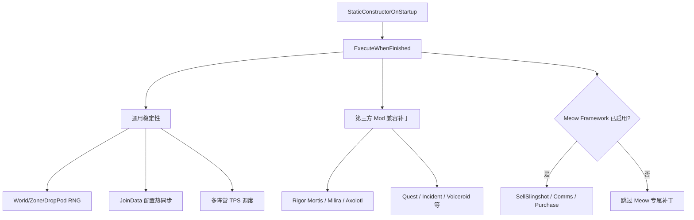
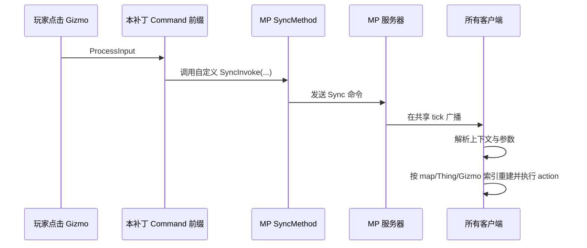

# 联机补丁架构与兼容性审阅

审阅日期：2026-07-25  
审阅对象：`MP_MeowOnlineShop` 3.0.6（RimWorld 1.6）  
方法：静态源码审阅；同时对照本机 `Multiplayer-master` 源码中同步 API、`JoinDataWindow` 与 `NodeTreeDialogSync` 的实现。未进行多人运行回归，因此本文将“已由代码证明”和“需要实机验证”明确分开。

## 结论摘要

项目的总体方向正确：启动时延迟到全部 Mod 加载结束后装配，绝大多数补丁以“目标类型存在才启用”的方式隔离；随机数修复也普遍使用 `try/finalizer` 成对恢复状态。对标准 `Dialog_NodeTree`，Multiplayer 已自行同步选项激活，因此项目在需要替换的通讯场景中改为同步具体交易/请求动作，思路合理。

但当前存在一个应优先处理的高风险问题，以及两类高概率兼容风险：

| 优先级 | 问题 | 后果 |
| --- | --- | --- |
| P1 | 入会配置热同步曾直接覆盖本机配置并自动继续连接 | 不受信任或误配主机可静默改写本地 Mod 配置；热重载失败也可能留下半更新状态（3.0.117 已改为分类热应用 + 回滚） |
| P1 | 四套 Gizmo 重放同步方法没有声明 `SyncContext` | 多地图、多阵营或依赖 `Find.CurrentMap`/选择集的动作可能在错误上下文执行，造成无效操作或 desync |
| P2 | Milira/Axolotl 模式补丁按名称启发式注册私有方法，并吞掉注册异常 | 上游 Mod 更新后可能同步了错误方法、漏同步，且日志不足以定位；不同环境的注册顺序风险增大 |
| P2 | 常开高频诊断日志 | 通讯、战斗和交易密集时增大 I/O、日志噪音与排障成本 |

配置热同步已在 3.0.117 改为“可验证项热应用、不可验证项走原生重启、失败整体回滚、任何风险项都不自动连接”；自定义 Gizmo 命令仍应补齐上下文与空对象取消规则。

## 调整进度

2026-07-25 已完成第一轮修复：

- `Patch_MpConfigHotSync` 3.0.117 改为默认启用但按项验证：标准 `ModSettings` 与 HugsLib 只有在运行实例、`WriteSettings`、字段/HugsLib 保存链全部验证通过后才热应用；XML Extensions、无运行实例、无 `WriteSettings`、验证失败或客户端独有配置一律保留给原生 Fix and Restart 流程，并阻止自动连接。
- 可用 `-mpmeowhotcfg=false` 完全禁用该补丁，恢复 Multiplayer 原生的临时配置导入与重启流程。
- 所有写文件与运行时变更先备份；只要有一项需要重启/失败/被拒绝，就回滚本批已热应用的变更。
- Milira Weapon/Shield/Flight 与 Axolotl Weapon 的自定义 Gizmo 重放同步方法现在携带 `SyncContext.CurrentMap`，并启用 `CancelIfAnyArgNull()`。
- Rigor Mortis 与 Meow Purchase 的高频追踪日志默认关闭；需要排障时再临时开启相应 `ModDebug` 开关。
- Release 构建已验证通过：0 warning、0 error。3.0.117 的多人运行回归仍在执行。

## 架构

### 装配与依赖

- 元数据在 `About/About.xml` 声明硬依赖 `rwmt.Multiplayer`，并要求在 Multiplayer、Meow Framework、Online Shop 之后加载。
- `MpMeowOnlineShopBootstrap` 位于 `Patch_SellSlingshot.cs`，标记为 `StaticConstructorOnStartup`，通过 `LongEventHandler.ExecuteWhenFinished` 延迟装配。
- 不依赖 Meow Framework 的补丁始终尝试装配；Meow Framework 相关的弹弓、通讯台、购买流程只在 `EoralMilk.MeowFramework` 启用时装配。
- 工程目标为 .NET Framework 4.7.2，直接引用 RimWorld、Unity、Harmony 与 `0MultiplayerAPI.dll`。

### 同步模型及本项目的接入点

Multiplayer 复制的是命令，而非持续复制整个游戏状态。`MP.RegisterSyncMethod` 会向方法注入同步逻辑；服务器按共享 tick 广播，所有客户端在命令执行时重放。源代码中的 `SyncUtil.WriteContext` 明确表明：若 handler 的 `context` 为 `SyncContext.None`，不会携带当前地图、选择集或世界选择。

项目主要有四种接入方式：

1. **直接同步目标 Mod 的状态变更方法**：例如 SellSlingshot 的 `TryLaunch`、部分 Rigor Mortis 和能力方法。
2. **自定义静态重放方法**：把 `mapIndex`、Thing ID、组件类型、Gizmo 来源方法和索引序列化，然后在各端重建 Gizmo 后执行其 action。Milira 三类模式与 Axolotl 武器模式使用此路径。
3. **Harmony 包裹确定性随机数**：`DeterministicRandScope` 同时处理 `Verse.Rand`、地图 Rand 与 World Rand；若目标 Mod 使用 Unity Random，个别补丁额外保存/恢复 `UnityEngine.Random.state`。
4. **反射/转译兼容**：按可选 Mod 的类型和成员存在情况打补丁，包含存档引用修复、随机元素替换、通讯 UI 适配与 TPS 调度。

## 已确认的良好实践

- 启动层做了总 `try/catch`，单个可选补丁失败不会阻断其他兼容项。
- `MpRuntimeInfo` 不再进行全程序集猜测扫描，而是对已知 Multiplayer 私有符号做一次性解析，并在缺失时采用保守降级。
- `DeterministicRandScope` 将 Push/Pop 状态位写入 `__state`，大多数调用点用 Harmony finalizer 清理，异常路径不会遗留随机数状态。
- `Patch_MultifactionTpsOptimize` 在检测到 Multiplayer async-time 或安全模式时退回原始 `MapPostTick`，且实验调度器默认关闭。
- `Patch_AxolotlComms`、Rigor Mortis 通讯等路径具备同步方法缺失时的显式拒绝/日志分支，优于直接在本地继续执行。
- 项目注释已明确认识到 `string.GetHashCode()` 不能作为跨进程随机种子；相关实现改用稳定字符串哈希。

## 发现与建议

### P1：配置热同步绕过 Multiplayer 的临时配置与重启隔离

证据与现状（3.0.117）：

- 旧实现遍历来自远端的 `remoteModConfigs`，解析路径后直接写活动设置文件，并在热重载成功后调用 `connectAnyway`。
- 对照 Multiplayer 自身 `Source/Client/Util/SyncConfigs.cs`：官方流程将远端配置写入 `MultiplayerTempConfigs`，设置子进程标记后重启；重启前不会直接覆盖活动 Mod 的常规设置文件。
- 3.0.117 先做 `(modId, fileName)` 到运行中 Mod/实例类型的严格映射，路径必须落在 `GenFilePaths.SaveDataFolderPath` 下，拒绝路径分隔符、非法文件名、`..`、超长内容与未知 Mod；写入前对文件和运行时字段快照，失败时回滚；只有全部配置 `hot/unchanged` 且没有客户端独有配置时才调用 `connectAnyway`。

影响（旧行为）：

- 主机传来的内容会直接覆盖客户端本地设置。即使主机本身不是恶意来源，也可能覆盖包含个人路径、账号、服务地址或本地偏好的第三方 Mod 配置。
- `fileName` 与内容来自网络数据。旧实现缺少严格的 Mod ID/设置类白名单、文件名格式验证、长度限制、内容预览和明确用户确认。
- 反射热重载任一 Mod 失败时，文件可能已经写入；旧逻辑会阻止自动连接，但没有回滚已覆盖的文件。

落地（3.0.117）：

1. 默认启用，但支持 `-mpmeowhotcfg=false` 完全禁用，禁用后不安装补丁、不改任何配置。
2. 普通 `ModSettings`：modId 必须是运行中 Mod 的 `PackageIdPlayerFacing`，fileName 必须是该 Mod 运行实例类型名，实例必须存在且 `modSettings != null`；通过 Scribe 加载 staging 文件、调用 `WriteSettings`、确认至少一个具体字段变化后才写正式文件。
3. HugsLib：快照 `StringValue`/`HasUnsavedChanges`，应用远端 handle 值并调用 `SaveChanges()`；失败时恢复快照并再次保存。
4. XML Extensions 等启动期绑定配置不热应用，只审计为 `restartRequired`；任何非 `hot/unchanged` 项都会使本批变更整体回滚并禁止自动连接，保留 JoinDataWindow 供人工选择。

### P1：自定义 Gizmo 回放命令未携带 Multiplayer 执行上下文

证据：

- `Patch_MiliraWeaponMode.cs:87`、`Patch_MiliraShieldMode.cs:91`、`Patch_MiliraFlightMode.cs:93`、`Patch_AxolotlWeaponMode.cs:102` 都直接注册静态 `SyncInvoke*CommandByIndex`。
- 这些方法随后用 `mapIndex` 和 Thing ID 重建组件/Gizmo（例如 Milira Weapon 的 `:257-325`），并从 `Command.ProcessInput` 前缀调用。
- 注册结果未调用 `SetContext(...)`、`CancelIfAnyArgNull()` 或选择集取消规则。
- 对照 Multiplayer `SyncHandler` 的默认 `context` 和 `SyncUtil.WriteContext`，默认 `SyncContext.None` 不会记录 `Find.CurrentMap`、地图选择集或世界选择。

影响：

- 参数可找到地图和物体，但 Gizmo action 的内部实现仍可能读取 `Find.CurrentMap`、当前玩家 faction、`Find.Selector` 或 queue 键状态。这在多地图/多阵营中尤其危险：同一同步命令可在每个客户端的不同本地 UI 上下文运行。
- 重新生成 Gizmo 列表再按索引取 action，本身也假设列表顺序与可用性完全确定；只要本地 UI 条件、权限或临时状态不同，索引可能指向不同命令或越界后静默返回。

建议：

1. 为每个重放方法保存 `var sync = MP.RegisterSyncMethod(...)`，并根据真实调用链设置最小上下文。地图 Gizmo 通常至少需要 `SyncContext.CurrentMap`；若 action 使用选择对象/队列键，则加 `MapSelected`/`QueueOrder_Down`。先在目标 Mod 源码验证后再选具体标志。
2. 同步时传递并验证 map 的稳定 ID、组件的直接可序列化引用（或 SyncWorker）和命令的稳定业务标识；不要把 Gizmo 列表索引作为唯一业务协议。
3. 在重放前记录一次 debug 日志：命令名称、当前地图、目标地图、当前 faction、生成的 Gizmo 类型/标签和索引；不匹配应告警而非静默返回。
4. 用主机 + 非主机、两张地图、不同 faction 的组合，对每个模式按钮至少重复三次。

### P2：按名称启发式扫描并注册同步方法，且异常被吞掉

证据：

- Milira Weapon 的 `:187-203`、Shield 的 `:237-254`、Flight 的 `:233-249`、Axolotl Weapon 的 `:363-379` 都从组件的全部声明实例方法中，按 `switch`/`toggle`/`mode`/`verb` 等名称筛选，再调用 `MP.RegisterSyncMethod`。
- 注册失败在多个实现中被空 `catch` 吞掉（如 Milira Flight `:273-282`、Shield `:278-287`）。
- Multiplayer 注册方法会将 handler 加入全局同步表并对方法打补丁；这是需要在所有客户端保持相同顺序和语义的协议面。

影响：

- 上游 Mod 新增一个满足名称与签名条件、但不应由玩家同步的方法时，可能被错误同步；反之重载或签名变化会使正确方法不再注册。
- 失败被吞掉时，用户只会看到功能失效或之后的 desync，无法判断目标方法、重载、序列化类型还是注册顺序出了问题。

建议：

1. 用“目标 Mod 版本/程序集哈希 → 精确 `MethodInfo` 签名”的白名单替代启发式扫描；版本不匹配时禁用该子补丁并输出一次清晰警告。
2. 若保留扫描，只把候选结果写入启动摘要（完整类型、签名、同步 ID），并把异常内容记录为警告；不要静默忽略。
3. 对注册的引用类型参数明确验证 Multiplayer 是否有 serializer；无 serializer 时添加 SyncWorker 或拒绝注册。

### P2：始终开启的诊断日志会影响联机运行质量

证据：`Patch_SellSlingshot.cs:22` 将 `EnableRigorMortisTrace` 设为 `true`，`:24` 将 `EnableMeowPurchaseTrace` 设为 `true`；注释本身将它们描述为排障日志。

影响：战斗、交易、通讯密集时频繁写入 RimWorld 日志会增加 I/O、扩大日志文件，并掩盖真正的 Multiplayer 报错。该问题通常不会直接 desync，但会降低 TPS 和可诊断性。

建议：默认关闭，两者改为设置页中的临时调试开关；采用限频、采样或“首次命中一次”的日志策略。

### P3：反射目标与转译补丁的升级漂移面很大

项目约有百余处 Harmony 安装点，许多依赖类型名、成员名和 IL 形状。项目已经在不少位置做了空目标降级，但缺少统一的“已解析目标清单”和版本兼容矩阵。第三方 Mod 或 Multiplayer 更新后，补丁可能静默跳过，或转译替换 0 条指令后继续运行。

建议：启动后汇总输出每个子补丁的状态（已启用/跳过/失败、目标完整签名、Harmony owner ID）；对关键 transpiler 将“替换数为 0”升级为禁用该子补丁的明确警告。为每个支持的目标 Mod 记录已验证版本与最小多人回归用例。

## 风险外的注意项

- `Patch_MultifactionTpsOptimize` 的实验调度默认关闭；不建议仅凭静态审阅开启。它直接影响 `MapPostTick`，应作为独立实验功能维护。
- 多层 `Rand` 包裹虽然方向正确，但局部实现使用静态字段保存待 Pop 的地图。当前 RimWorld 主游戏逻辑通常单线程，仍应在嵌套调用与异常路径中验证 Push/Pop 配对；未来若出现重入，优先改为 per-invocation `__state` 对象或栈。
- 未发现使用 `DateTime.Now`、`System.Random` 或字符串运行时 `GetHashCode()` 作为同步随机种子的直接证据；`Patch_MpConfigHotSync` 的本地窗口去重已改为引用比较，不再依赖对象哈希码，不属于游戏状态协议。

## 建议的回归矩阵

| 场景 | 必测动作 | 通过条件 |
| --- | --- | --- |
| Meow 商店 | 确认发射、购买、通讯台打开/交易 | 两端库存、银币、掉落点、Quest/Letter 一致；无 Rand mismatch |
| Milira / Axolotl | 每种模式按钮、能量/护盾操作 | 主机与客户端分别触发；双地图、不同 faction 下结果一致 |
| Rigor Mortis | 通讯、故事选项、棺材恢复/坠落 | Dialog 行为一致且不会重复执行 |
| 世界/事件 | Caravan、Zone Gizmo、采矿/污染事件 | 连续触发后 World Rand 与 trace 无分叉 |
| 加入会话 | 仅配置差异、未知配置项、热重载失败 | 可验证项热应用并自动继续；重启项/失败项整体回滚、保留人工决定，不自动连接 |
| 性能 | 2000+ tick、多地图、战斗和交易同时进行 | 日志量受控；实验 TPS 调度关闭时行为与原版 MP 一致 |

## 审阅边界与后续

本文不将“未发现”表述为“已证明安全”。特别是第三方 Mod 的源码、实际加载程序集版本、Harmony 补丁排序和多人日志未在本次静态审阅中获得。修复 P1 后，应先对涉及的目标 Mod 版本记录启动解析日志，再执行上表的主机/客户端回归，并保留 desync trace 作为验收证据。
